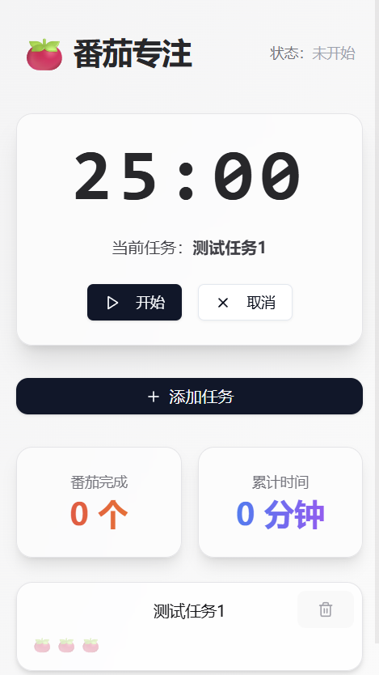

# 🍅 番茄专注 App

一个基于 **React + Capacitor** 构建的番茄钟专注应用，支持任务管理、倒计时专注、专注统计，帮助用户高效管理时间与精力。

## ✨ 项目特点

- ✅ 支持自定义任务列表
- ⏳ 番茄钟倒计时功能，自动开始/暂停
- 📊 数据统计功能，记录每个任务完成的专注时长
- 📱 支持打包为安卓 App，移动端体验良好

## 🧪 技术栈

- **前端框架**：React + TypeScript
- **样式库**：Tailwind CSS
- **移动端打包**：Ionic Capacitor
- **图标**：Lucide + Iconify
- **状态管理**：React Hooks + useState/useEffect
- **本地存储**：IndexedDB / localStorage（可扩展）

## 📦 安装与运行

### 本地开发

```bash
# 安装依赖
pnpm install

# 启动开发服务
pnpm dev

```

### 打包为安卓 App

```bash
# 安装 Capacitor 所需依赖
pnpm cap add android

# 构建前端
pnpm build

# 拷贝资源到 Android 项目
pnpm cap copy android

# 打开 Android Studio
pnpm cap open android

# 真机调试
pnpm cap run android

```

# 📸 应用截图


# 🛠️ 反馈与建议
如果你在使用过程中遇到问题，或者有任何功能建议，欢迎通过 Issue 提出。非常期待你的反馈！

# 📄 License
本项目基于 MIT License 开源，欢迎自由使用与二次开发。
